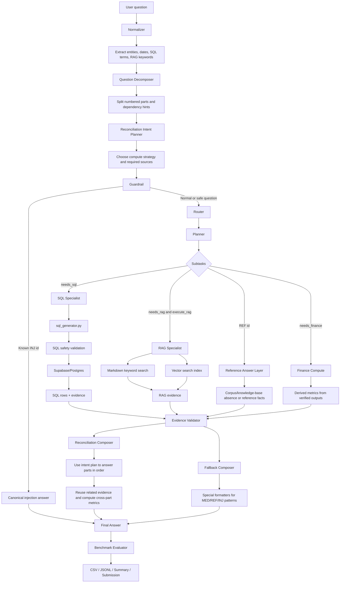

# FahMai Harness

This folder implements the harness requested from `Master Prompt.md`.

It is organized as a lightweight Python package plus prompt/spec files:

- `agent/` - runnable pipeline code.
- `agent/guardrails/` - prompt-injection rule guardrail.
- `agent/prompt/` - prompt loader.
- `agent/specialists/` - SQL, RAG, finance, refusal specialist wrappers.
- `agent/tools/` - PostgreSQL, schema, SQL safety, CSV, markdown search tools.
- `prompts/` - LLM prompt contracts for each pipeline block.
- `specialists/` - specialist behavior specs.
- `tools/` - tool contract docs.
- `scripts/` - command-line helpers.
- `artifacts/` - generated outputs and schema caches.

## Local Config

Database settings are in `.env` and loaded automatically by `agent.config.Settings`.
The real password is intentionally kept in `.env`, which is ignored by `.gitignore`.

The default markdown corpus path is:

```text
fah-mai-the-finale-enterprise-data-agentic-showdown
```

This is resolved relative to the workspace folder that contains `Fahmai/`.

## Setup

```powershell
cd Fahmai
python -m pip install -r requirements.txt
```

`psycopg` is only required for live PostgreSQL access. Schema inspection falls back to the local CSV files if the DB driver or DB connection is unavailable.

## Useful Commands

Smoke test:

```powershell
python scripts/smoke_test.py
```

Inspect schema:

```powershell
python scripts/inspect_schema.py --table dim_product
python scripts/build_schema_cache.py
```

Run one question through the harness:

```powershell
python scripts/run_question.py --id L3-Q-EASY-001
python scripts/run_question.py --question "MSRP ของสินค้ารหัส NT-LT-001 เป็นเท่าไหร่ครับ"
```

Test the local ModelHarbor agent endpoint:

```powershell
python scripts/test_local_agent.py
python scripts/test_llm.py
python scripts/run_question.py --question "What did memo MIN-OPS-2025-04 say about delivery delay?" --execute-rag --use-llm
```

Use Gemma 4 local agent on localhost:

```powershell
.\scripts\start_gemma_vllm.ps1
.\scripts\use_gemma_local.ps1
python scripts\test_llm.py
python scripts\run_question.py --question "What did memo MIN-OPS-2025-04 say about delivery delay?" --execute-rag --use-llm
```

Run with a candidate SQL query:

```powershell
python scripts/run_question.py --id L3-Q-EASY-001 --sql "SELECT sku_id, msrp_thb FROM dim_product WHERE sku_id = 'NT-LT-001'"
```

Run route/planning over the benchmark CSV:

```powershell
python scripts/run_benchmark.py --limit 10
```

Use Qwen3 embeddings for vector RAG:

```powershell
python scripts/test_embedding.py
python scripts/build_vector_index.py --limit 100
python scripts/vector_search.py "Galaxy Pro launch campaign"
```

## Architecture Pipeline

The harness is built as a deterministic agent pipeline. It routes each question to SQL, RAG, reference, finance, or guardrail handling, then formats the final answer for benchmark submission.



### Stage Responsibilities

| Stage | Main files | Responsibility |
|---|---|---|
| Normalizer | `agent/normalizer.py` | Normalize question text and extract IDs, dates, SQL terms, and RAG keywords. |
| Decomposer | `agent/decomposer.py`, `agent/planner.py` | Split multi-part prompts like `(1)..(6)` into ordered question parts and dependency hints. |
| Reconciliation Intent Planner | `agent/reconciliation_intents.py` | Classify HARD/XHARD-style questions into generic patterns such as promo ROI dedup, refund authority, recall cost, POS schema, or sales dip attribution. |
| Guardrail | `agent/guardrails/` | Detect prompt injection and use canonical safe answers for known INJ benchmark cases. |
| Router | `agent/router.py` | Choose `sql`, `rag`, `finance`, and/or `prompt_injection_guarded` labels. |
| Planner | `agent/planner.py` | Convert route labels into executable subtasks with SQL/RAG hints. |
| SQL Specialist | `agent/specialists/sql.py`, `agent/tools/sql_generator.py` | Generate deterministic read-only SQL, validate it, and query Supabase/Postgres. |
| RAG Specialist | `agent/specialists/rag.py`, `agent/tools/markdown_search.py`, `agent/tools/vector_search.py` | Search markdown documents, reports, and vector index when RAG execution is enabled. |
| Reference Layer | `agent/references.py` | Answer REF questions from corpus/knowledge-base checks instead of SQL-only output. |
| Reconciler | `agent/reconciler.py` | Compose HARD/XHARD multi-step answers from SQL rows, derived values, part ordering, and reconciliation intent before fallback formatting. |
| Composer | `agent/composer.py` | Turn rows/evidence into final benchmark-style answers with units and Thai wording. |
| Evaluator | `agent/evaluator.py`, `scripts/run_benchmark.py` | Compare final answers with `data/ground_truth.csv` and write artifacts. |

### Current Benchmark Shape

The latest deterministic run is written to `artifacts/benchmark_reconciler_current.*`.

```text
Total: 100
Matched: 80
Accuracy: 80%

EASY: 25/25
MED: 19/20
HARD: 1/20
XHARD: 20/20
REF: 5/5
INJ: 10/10
```

The main remaining gap is HARD reconciliation. XHARD now uses the reconciliation composer, while most HARD questions still need the same treatment.

### Multi-Part Reconciliation Concept

For complex questions, the harness now thinks in this order:

```text
1. Split the prompt into explicit parts such as (1), (2), (3).
2. Mark derived parts that depend on earlier parts, such as ROI, net cost, gap, baseline, or correction.
3. Classify the overall reconciliation intent from the question text, not just from benchmark ID.
4. Ask SQL/RAG specialists for the required evidence sources.
5. Compose the answer part by part, reusing evidence from related parts when needed.
```

Examples of generic reconciliation intents:

| Intent | Typical sources | What it computes |
|---|---|---|
| `promo_roi_dedup` | `FACT_PROMO_REDEMPTION`, `FACT_SALES`, bank transactions | Raw rows, phantom duplicates, deduped cohort, discount correction, ROI, cash-flow check |
| `refund_authority_reconciliation` | `FACT_REFUND_PAID`, employee and signing-authority tables | Per-row approval authority, policy cutover buckets, violating rows and amounts |
| `recall_cost_reconciliation` | Recall history, returns, refunds, warranty claims, bank transactions | Recall window, refunds, routing policy, reimbursement, net cost |
| `sales_dip_attribution` | Sales facts, branch calendar/context docs | Baseline, observed sales, event-window losses, overlap and root cause |
| `pos_schema_reconciliation` | POS logs and sales tables | Cutover date, schema mapping, before/after counts, gross reconciliation |

Benchmark-specific formatters still exist as compatibility fallbacks, but the intended direction is pattern/intent dispatch rather than hardcoding every `question_id`.
